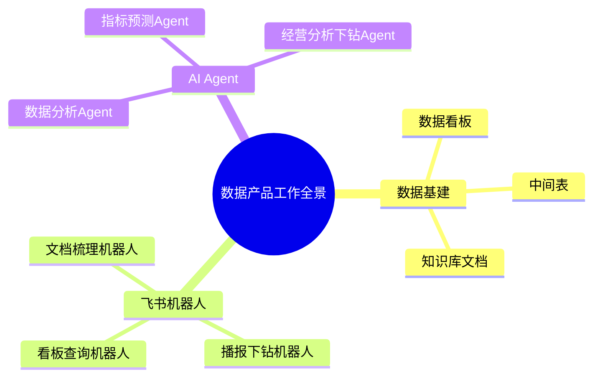
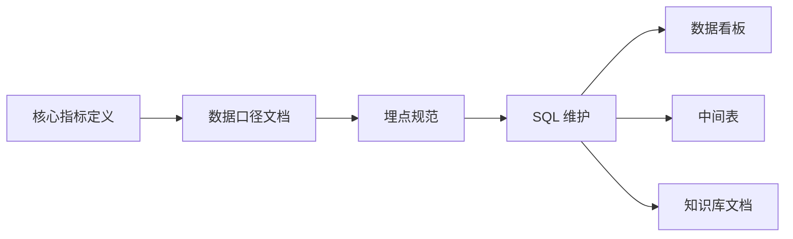
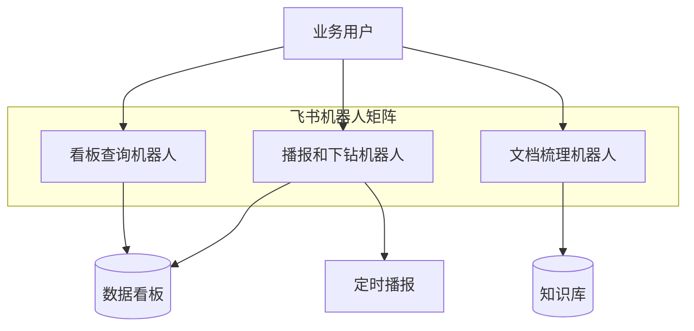
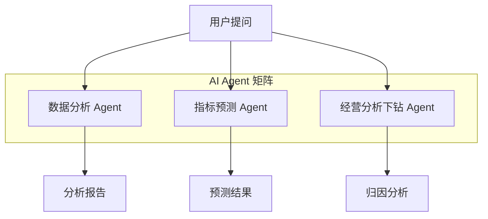
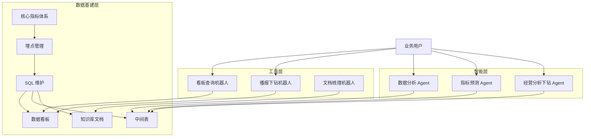

# 数据产品工作全景 {color="blue" align="center"}

---

<callout emoji="rocket" background-color="light-blue" border-color="blue">
本文档系统梳理数据产品团队的核心工作模块，涵盖**数据基建**、**飞书机器人**、**AI Agent** 三大板块，旨在建立清晰的工作地图和协作规范。
</callout>

---

## 一、核心指标和数据口径维护 {color="blue"}

<callout emoji="bulb" background-color="light-yellow" border-color="yellow">
**目标**：将核心指标、数据口径、埋点和 SQL 统一管理，确保数据一致性和可追溯性。
</callout>

### 1）数据看板

| 维度 | 说明 |
|------|------|
| 看板目标 | 实时/离线核心指标可视化，支持多维度下钻分析 |
| 指标体系 | 按业务线梳理核心指标树，明确每个指标的口径、数据源、刷新频率 |
| 埋点管理 | 埋点事件 → 参数 → 口径映射表，确保埋点和看板指标一一对应 |
| SQL 规范 | 统一 SQL 命名规范，版本管理，变更需走 Review 流程 |

### 2）中间表

| 维度 | 说明 |
|------|------|
| 表定位 | 承接底层明细数据与上层看板/分析之间的数据加工层 |
| 口径沉淀 | 核心指标口径固化到中间表，避免下游重复计算，保证口径一致 |
| 血缘管理 | 维护表间依赖关系，任何口径变更可快速评估影响范围 |
| 调度监控 | 配置调度任务及数据质量校验规则，异常自动告警 |

### 3）知识库文档

| 维度 | 说明 |
|------|------|
| 文档范围 | 指标口径文档、埋点设计文档、SQL 脚本说明、数据字典 |
| 更新机制 | 口径变更同步更新文档，建立变更日志追踪 |
| 协作规范 | 统一文档模板，按业务线分目录组织，支持全文搜索 |

---

## 二、3 个飞书机器人 {color="blue"}

<callout emoji="zap" background-color="light-green" border-color="green">
**目标**：通过飞书机器人实现数据的自动播报、交互式查询和文档智能梳理，降低数据使用门槛。
</callout>

### 1）看板查询机器人

<grid cols="2">
<column>

<callout emoji="bulb" background-color="light-blue">

**功能定位**

在飞书群内通过自然语言查询看板数据，实时返回指标结果

</callout>

</column>
<column>

<callout emoji="white_check_mark" background-color="pale-gray">

**核心能力**

- 自然语言转 SQL
- 多维度筛选与聚合
- 图表卡片渲染返回
- 权限校验与数据脱敏

</callout>

</column>
</grid>

### 2）播报和下钻机器人

<grid cols="2">
<column>

<callout emoji="fire" background-color="light-orange">

**功能定位**

定时推送核心指标播报，支持交互式下钻分析异常原因

</callout>

</column>
<column>

<callout emoji="white_check_mark" background-color="pale-gray">

**核心能力**

- 定时/事件触发播报
- 同环比自动计算
- 异常指标高亮标注
- 交互式下钻按钮

</callout>

</column>
</grid>

### 3）文档梳理机器人

<grid cols="2">
<column>

<callout emoji="memo" background-color="light-purple">

**功能定位**

自动梳理和更新知识库中的数据文档，保持文档与实际口径同步

</callout>

</column>
<column>

<callout emoji="white_check_mark" background-color="pale-gray">

**核心能力**

- 自动检测口径变更
- 文档内容智能更新
- 关联文档交叉引用
- 文档质量巡检报告

</callout>

</column>
</grid>

---

## 三、3 个 AI Agent {color="blue"}

<callout emoji="warning" background-color="light-red" border-color="red">
**目标**：利用 AI Agent 实现数据分析自动化，从被动取数转向主动洞察，提升决策效率。
</callout>

### 1）数据分析 Agent

| 维度 | 说明 |
|------|------|
| 核心能力 | 自然语言驱动的自助数据分析，自动生成 SQL、执行查询、输出可视化报告 |
| 应用场景 | 临时取数、专题分析、数据验证、AB 实验分析 |
| 输出形式 | 结构化分析报告（含图表）、飞书文档自动生成 |

### 2）指标预测 Agent

| 维度 | 说明 |
|------|------|
| 核心能力 | 基于历史数据和外部因子，预测核心指标未来趋势，输出置信区间 |
| 应用场景 | 月度/季度目标预测、异常预警、资源规划辅助 |
| 输出形式 | 预测曲线图 + 关键影响因子排名 + 风险提示 |

### 3）经营分析下钻 Agent

| 维度 | 说明 |
|------|------|
| 核心能力 | 自动识别指标异动，沿维度树逐层下钻归因，输出根因分析和行动建议 |
| 应用场景 | 日报/周报异动分析、经营会议数据支持、复盘归因 |
| 输出形式 | 下钻路径可视化 + 贡献度分解 + 改进建议 |

---

## 整体协作架构 {color="blue"}

---

<callout emoji="memo" background-color="pale-gray">
**文档维护说明**：本文档由数据产品团队维护，如有指标口径变更、机器人功能迭代或 Agent 能力升级，请及时同步更新。
</callout>
