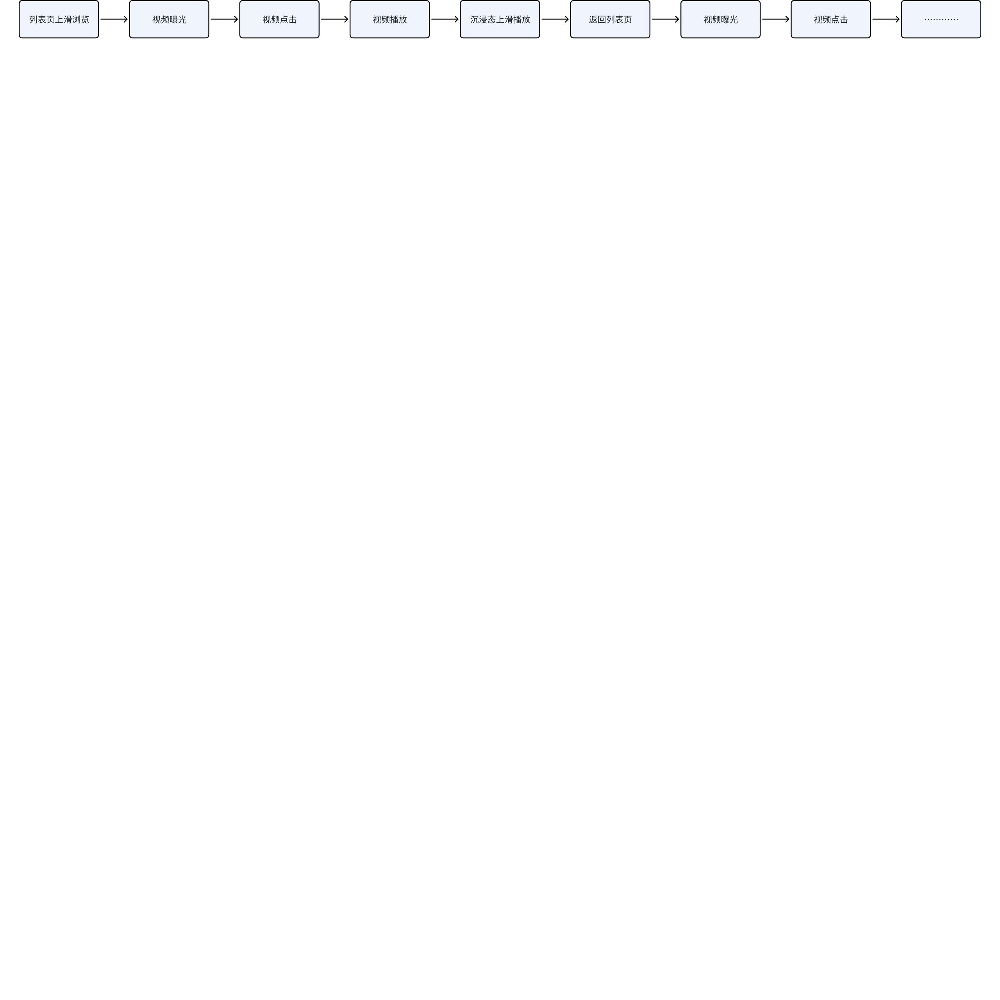
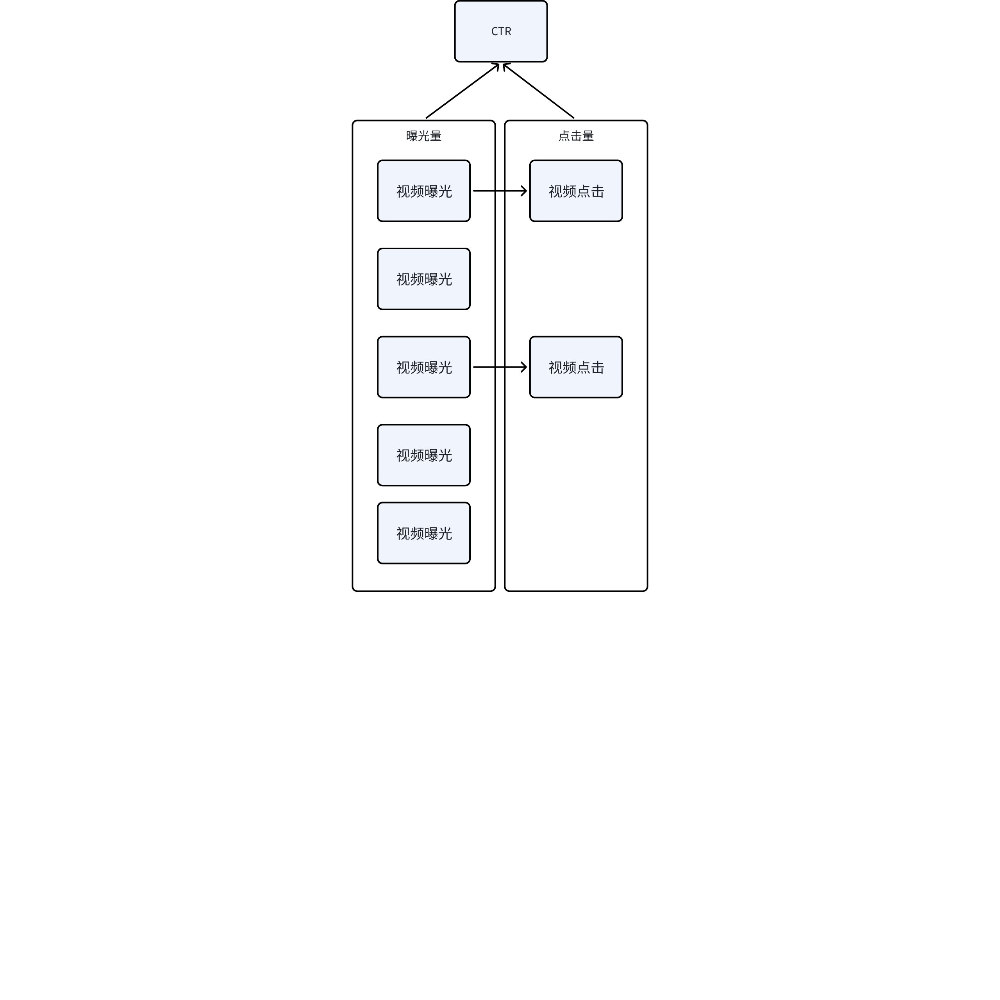
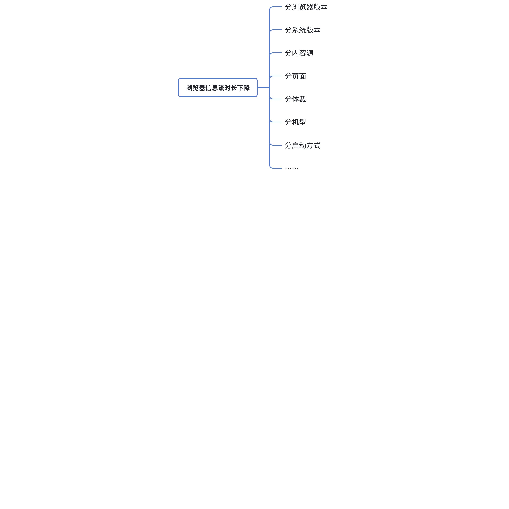
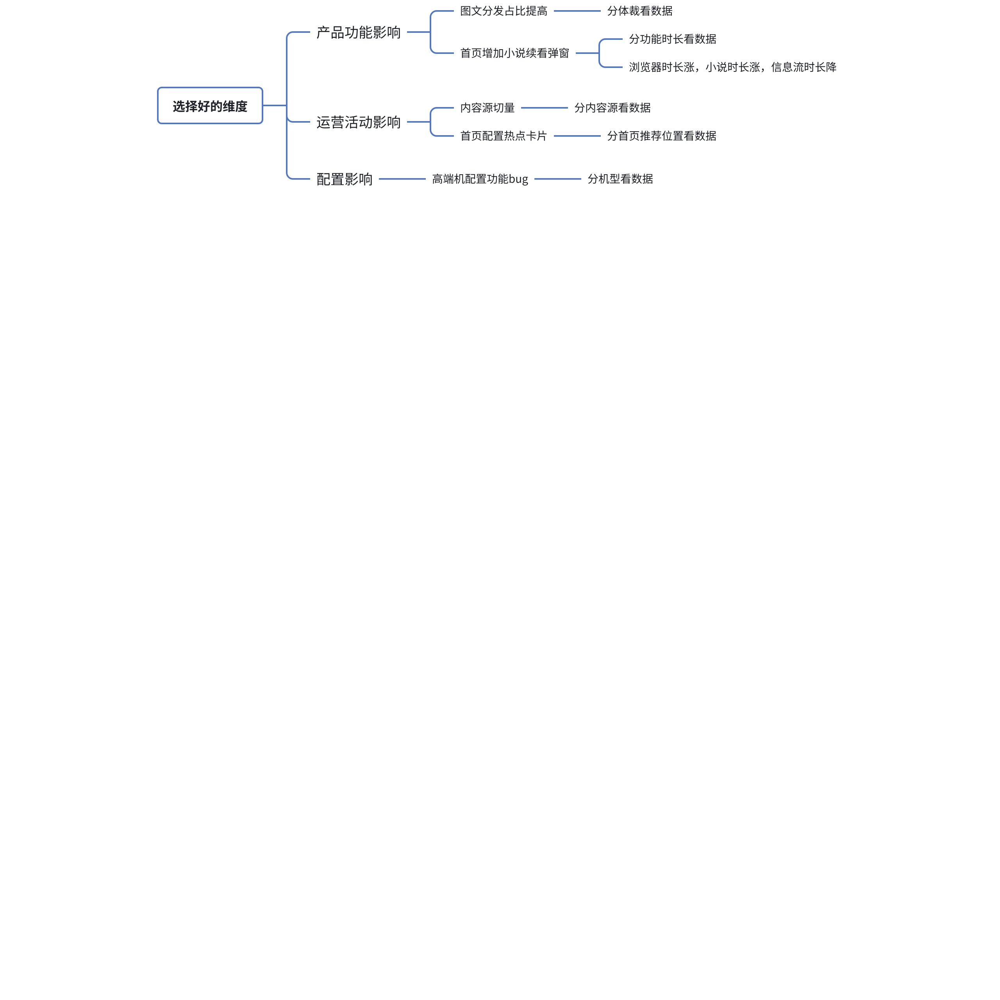
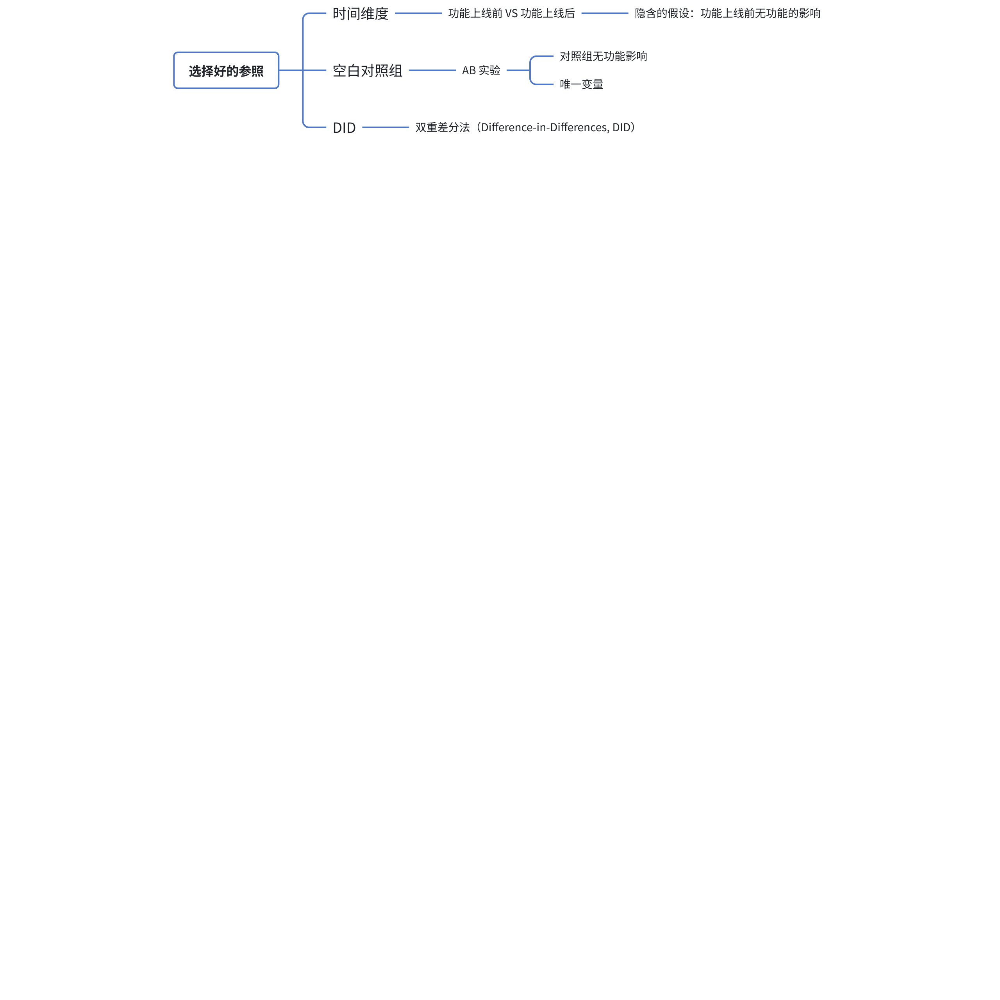
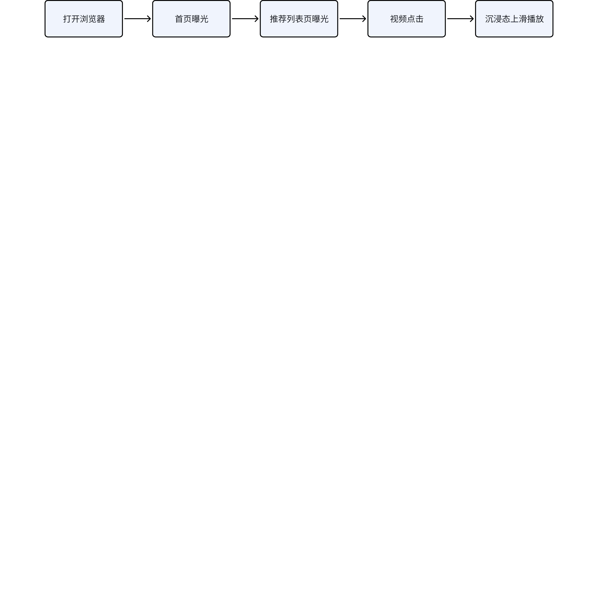
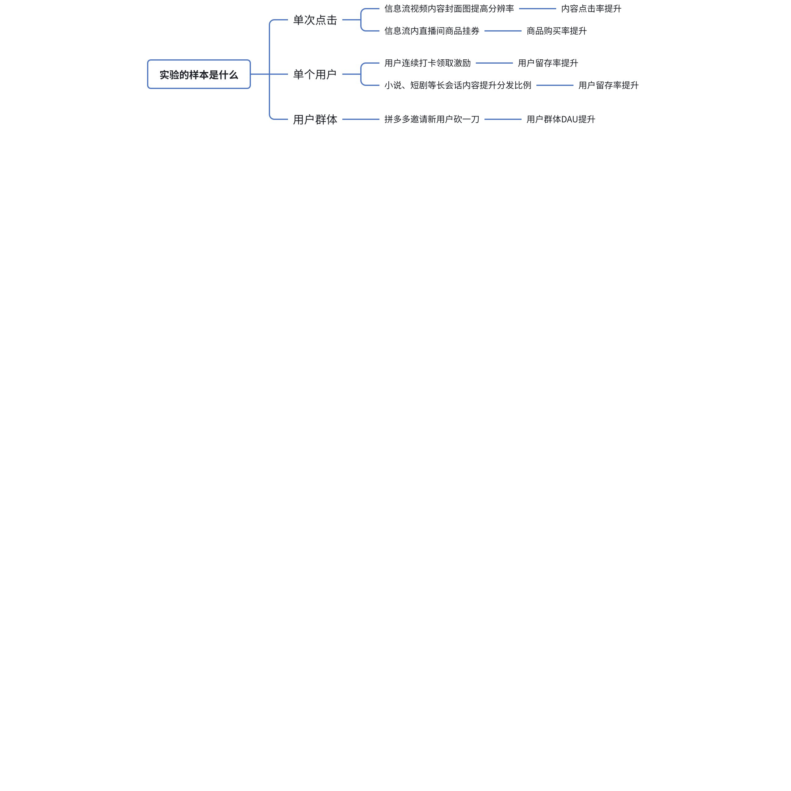
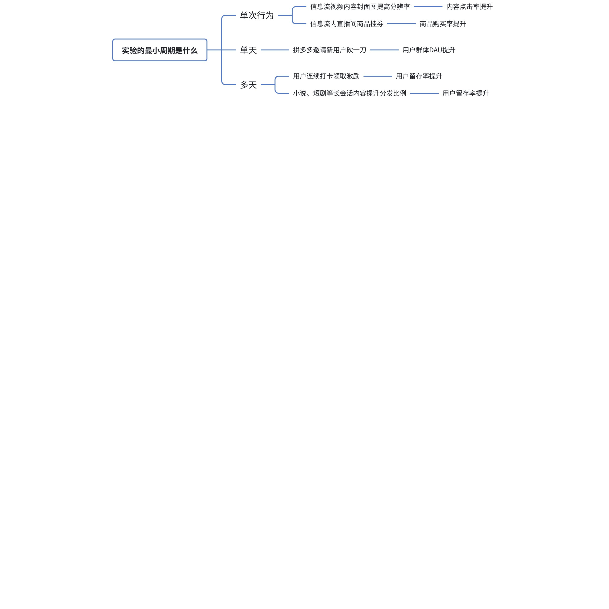
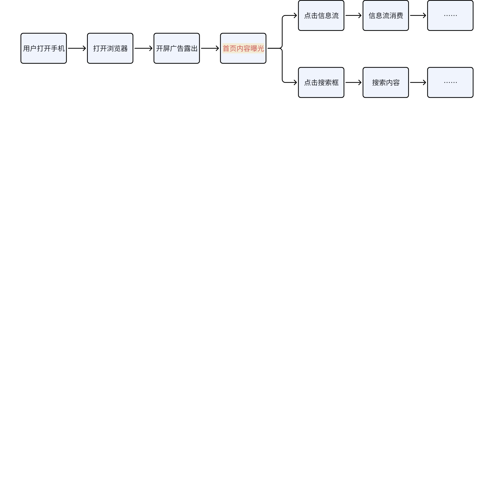
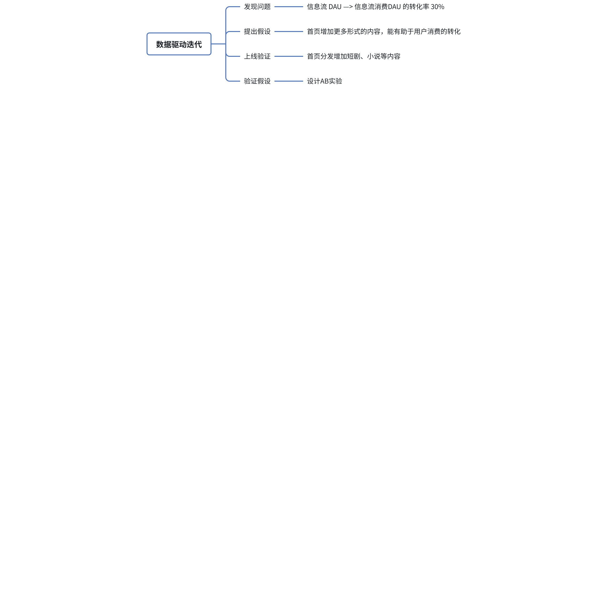

# 内容生态产运班2025届—数据分析

> 本文档为飞书文档归档副本，由 `feishu fetch` 抓取并转换为 Markdown。
> 原文为飞书 docx 资源，下方保留原始内容；图片/白板中的飞书内部图片链接可能因鉴权失效而无法直接渲染，已下载的白板图存放在同目录 `assets/`。

| 字段 | 值 |
|------|----|
| 原文链接 | https://mi.feishu.cn/docx/ZZrQdo9L0osPRcxe4rzcWNAanEW |
| 资源 token | `ZZrQdo9L0osPRcxe4rzcWNAanEW` |
| 原文最后修改 | 2025-10-29T15:05:24.000Z |
| 抓取归档日期 | 2026-07-02 |

---
## 1、数据埋点基础知识

### 1.1、讨论：

在浏览器信息流的各种分发场景下，某条时政类图文内容 A 和某条娱乐类短视频内容 B，该怎么评估谁更好，更受用户喜欢，更值得被推广给更多用户

### 1.2、为什么需要看数据

1）用户行为代表着用户的真实意图

“不要看他说了什么，要看他做了什么”

2）用户行为比用户的语言更精准，带有更小的噪声

“在汽车出现之前，用户不会说出他想要一辆汽车，只会说他想要一辆更快的马车 ”

### 1.3、数据埋点是什么

#### 1）数据埋点是用户行为的记录 

用户点击 -> 触发埋点 -> 客户端&服务端交互 -> 数据采集上报

有哪些类型的数据埋点： 

曝光、点击、时长、页面跳转

  

埋点包含什么信息：

事件、类型、参数

基于事件模型，在OneTrack埋点管理系统中，我们把事件（Event）、事件参数（Params）、页面模块、需求等字段信息，定义为“埋点元数据”：

- 事件是用户的一个操作行为，”描述用户与产品的交互行为与业务动作”，比如常见的view（浏览）、click（点击）和expose（曝光）。事件三要素：操作行为、参数/属性名、参数/属性值  
- 参数是事件的属性，是构成这个事件的不同维度的信息，比如触发这个事件的人、时间、地点、设备、操作的业务信息等等。

#### 2）埋点的应用

原始数据 —> 指标

举例：

用户的行为是离散的一次次具体的行为，我们需要的是统计的指标

如：

曝光量：

点击量：

播放量：

…… 

行为指标 —> 业务指标 

CTR =  点击量 / 曝光量 

参考内容：

<cite doc-id="T7khwbpO0iTJvPksSK0cIkfpnsd" file-type="wiki" title="新手必读基本概念" type="doc"></cite>

### 1.4、数据埋点该怎么设计

案例说明：

具体方案：

1）明确场景： 场景的起止点

2）明确上报内容：时长、点击行为、曝光行为 等 

3）明确上报参数：from_page， sessionID ……

大原则：

1）对行为进行抽象

2）考虑兼容性 和复用性

3）自上而下的框架设计

参考内容：

<cite doc-id="Ii3fwRFfUi0cOJk3kU1c8u3Gnug" file-type="wiki" title="关于埋点这件小事" type="doc"></cite>

## 2、排查数据问题

### 2.1、讨论 

浏览器日活下降怎么排查？

### 2.2、什么是数据问题

从一个案例出发

信息流时长下降：常见思路即拆以下维度

### 2.3、如何排查数据问题

#### A、如何选择好的维度

什么是好的维度：在该维度上，指标变化呈现很强的区分度

一言以蔽之：找到可能的影响因素，并在维度上做区分

#### B、如何选择好的参照

什么是好的参照：参照可以作为基准线 

重点介绍：

双重差分法（DID）是“政策评估与因果推断”中最常用的准实验方法之一，核心思路是通过“两次差分”剔除无关干扰，精准识别政策（或干预）对目标群体的真实因果效应。它尤其适用于“部分群体接受干预、部分群体不接受，且干预有明确时间节点”的场景（如某地区试点减税政策、某学校推行新教学模式）。

一、DID的核心逻辑：解决“选择偏差”与“时间趋势”

在评估政策效果时，最核心的难题是：\*\*如何确定“政策组的变化是否由政策导致”\*\*？  

- 若仅对比“政策后政策组与对照组的差异”：可能忽略两组原本就存在的“固有差异”（如经济发达地区先试点减税，即使不减税其经济增长也可能高于其他地区）；  
- 若仅对比“政策组政策前后的差异”：可能忽略“时间趋势的影响”（如全国经济整体上行，即使没有减税，政策组的经济也会增长）。  

DID通过“两次差分”同时解决这两个问题，逻辑公式可简化为：  

**政策效应 = （政策后政策组 - 政策前政策组） - （政策后对照组 - 政策前对照组）**  

直观理解：四组核心数据

假设我们有以下4个关键观测值（以“某地区试点最低工资政策对就业率的影响”为例）：

| 分组/时间 | 政策前（干预前） | 政策后（干预后） | 组内时间差分（后-前） |
|-|-|-|-|
| **政策组**（试点地区） | $Y_{10}$（试点前就业率） | $Y_{11}$（试点后就业率） | $\Delta_1 = Y_{11} - Y_{10}$（政策组自身变化） |
| **对照组**（非试点地区） | $Y_{00}$（非试点前就业率） | $Y_{01}$（非试点后就业率） | $\Delta_0 = Y_{01} - Y_{00}$（对照组自身变化） |
| **组间差分（政策-对照）** | $Y_{10} - Y_{00}$（固有差异） | $Y_{11} - Y_{01}$（政策后差异） | **DID效应 =**  $\Delta_1 $ - $\Delta_0 $ |

二、DID的基本假设：确保结果可靠的前提

DID的有效性依赖于3个核心假设，若假设不满足，结果可能存在偏差：

1. 平行趋势假设（Parallel Trends Assumption）

**最关键的假设**：在没有政策干预的情况下，政策组与对照组的“结果变量变化趋势”是平行的（即两组的时间趋势差异恒定）。  

- 通俗理解：如果政策从未实施，政策组的就业率（或其他结果）会和对照组以几乎相同的速度变化，两组的差距始终保持一致

2. 稳定单位处理值假设（Stable Unit Treatment Value Assumption, SUTVA）

- 通俗理解：相互独立 、非双边市场

3. 无遗漏变量偏差（No Omitted Variable Bias）

- 含义：政策实施后，除了“政策干预”本身，政策组与对照组之间没有其他“随时间变化的、影响结果变量的差异因素”

三、与其他方式的优缺点对比

| 方法 | 核心场景 | 优势 | 劣势 |
|-|-|-|-|
| 双重差分（DID） | 有明确干预时间、部分群体干预 | 控制时间趋势和固有差异，数据要求较低 | 依赖平行趋势假设，无法处理动态选择偏差 |
| 倾向得分匹配（PSM） | 横截面数据、干预无时间节点 | 解决“选择偏差”，匹配相似个体 | 无法控制时间趋势，依赖可观测变量完全性 |
| 合成控制法（SCM） | 单个/少数政策组（如某国政策） | 为政策组构建“合成对照组”，适合小样本 | 对数据量要求高，结果易受权重影响 |
| 断点回归（RD） | 干预基于某连续变量的断点（如高考分数线） | 接近随机实验，因果识别清晰 | 仅适用于断点附近样本，外推性差 |

DID是一种“性价比极高”的因果推断方法，无需进行随机实验（节省成本），仅通过面板数据即可识别政策效应。其核心是\*\*平行趋势假设\*\*，应用时需严格验证该假设，并通过安慰剂检验、异质性分析等确保结果稳健。在实际研究中，DID常与PSM、SCM等方法结合使用，进一步提升因果识别的可靠性，广泛应用于经济学、社会学、公共卫生等领域的政策评估（如教育政策、医疗改革、环境规制等）。

讨论：

双边市场该怎么找设计AB实验 

**双边市场**（如电商平台、外卖平台、网约车平台、社交平台等，存在 “供给方” 和 “需求方” 两类及以上相互依赖的用户群体）

如：闲鱼的场景，交易物品存在唯一性：实验组对购买者发券，促进用户购买，实验组的用户的购买提升，挤占掉对照组用户“原本可能购买的机会”

#### C、如何选择好的视角

如果做了一个优化沉浸态播放流畅度的功能，可以从哪个环节开始做AB？

1）样本是什么？

实验的目标决定实验的样本（样本即为最小作用颗粒度）

2）周期是什么？

实验的目标决定了实验的周期 

提问：为什么通常以天为维度统计数据？

#### D、如何选择好的起止点—链路分析 

举例：从功能影响的节点进行分析

上线功能：搜索框内搜索词推荐滚动轮播，返现信息流消费DAU下降

理论上，如果数据变化和该功能有关，则只会影响该功能往后的功能数据

## 3、发现优化机会

### 3.1、讨论：

作为信息流的产品，该如何提升消费用户数

### 3.2、如何寻找机会点

漏斗分析：

漏斗分析（Funnel Analysis）是一种数据驱动的用户行为分析方法，核心是模拟用户在完成特定目标（如注册、购买、留存）过程中的 “路径转化”，通过量化每一步的用户流失率，定位转化瓶颈，最终优化业务效率。它广泛应用于互联网、电商、金融等行业，是提升用户转化率的核心工具之一

##### 步骤 1：明确业务目标（核心前提）

先确定 “要分析什么目标”，避免漏斗设计无意义。目标需符合**SMART 原则**（具体、可衡量、可实现、相关、有时限）。常见业务目标：

##### 步骤 2：设计漏斗路径（关键环节）

根据目标拆解 “用户需经历的关键步骤”，需注意 3 个原则：

1. **按用户行为逻辑排序**：
2. **步骤不宜过多 / 过少**：
3. **排除 “非必要步骤”**：

##### 步骤 3：采集数据（数据基础）

##### 步骤 4：搭建漏斗并计算指标

##### 步骤 5：深度分析瓶颈（核心环节）

发现流失率高的步骤后，需进一步分析 “为什么用户会流失”，常用分析维度包括：

- **用户维度**：
- **场景维度**：
- **行为维度**：

##### 步骤 6：优化验证与迭代

针对分析结论制定优化策略，并通过 “A/B 测试” 验证效果，形成闭环

### 3.3、数据驱动 

##### **1）应该了解的DIKW模型** 

**Data（数据）→ Information（信息）→ Knowledge（知识）→ Wisdom（智慧）**

**通俗解释**

-  **数据（Data）**：原始的事实和数字，没有经过解释和加工，就像一堆“散落的字母”
-  **信息（Information）**：经过整理和结构化的数据，能回答“发生了什么”，就像把字母拼成“单词”，有了意义。
-  **知识（Knowledge）**：对信息的理解和应用，能回答“为什么”， 就像把单词拼成“句子”，能表达观点和逻辑。
-  **智慧（Wisdom）**：在具体情境中善用知识做出正确判断和决策，就像能用句子讲故事、传递经验，指导行动

 

**打个比方**

以“天气”来举例：

-  **数据**：温度 30°C，湿度 80%，风速 5m/s（原始监测值）
-  **信息**：今天是“高温+高湿”的天气（数据被解读出天气状况）
-  **知识**：这种天气容易中暑，要避免长时间户外活动（基于经验和规律）
-  **智慧**：决定把公司团建改到室内，既避免风险，又保持团队氛围（正确行动）

##### 2）数据驱动的核心特征

1. **决策依据转变**：
2. **闭环式优化**：
3. **目标导向明确**：

##### 3）数据驱动的关键环节

1. **数据采集**：
2. **数据处理与分析**：
3. **洞察转化为行动**：
4. **效果评估与反馈**：

### 3.4、如何进行迭代

举例：浏览器信息流消费用户渗透率提升 

### 3.5、推荐书目：

《关键迭代》

## 4、Q&A 环节

## 5、课程评价 

课程评价的链接和二维码，烦请大家评价

[https://m.beehive.miui.com/4DCnPTeGDveD138zT8WHZg](https://m.beehive.miui.com/4DCnPTeGDveD138zT8WHZg)

