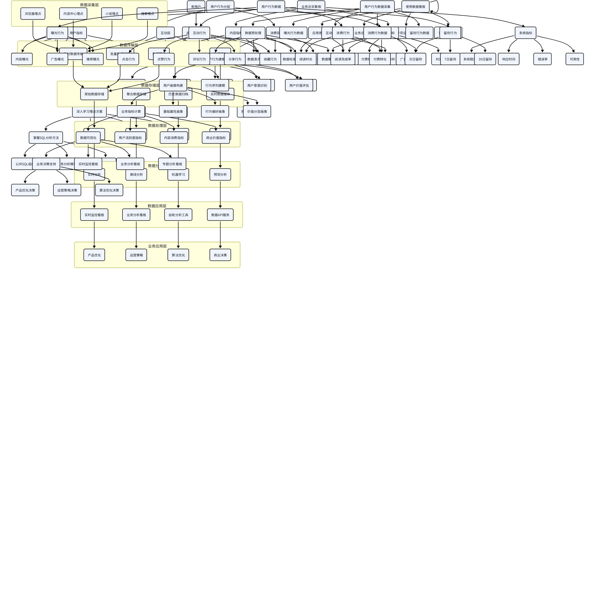
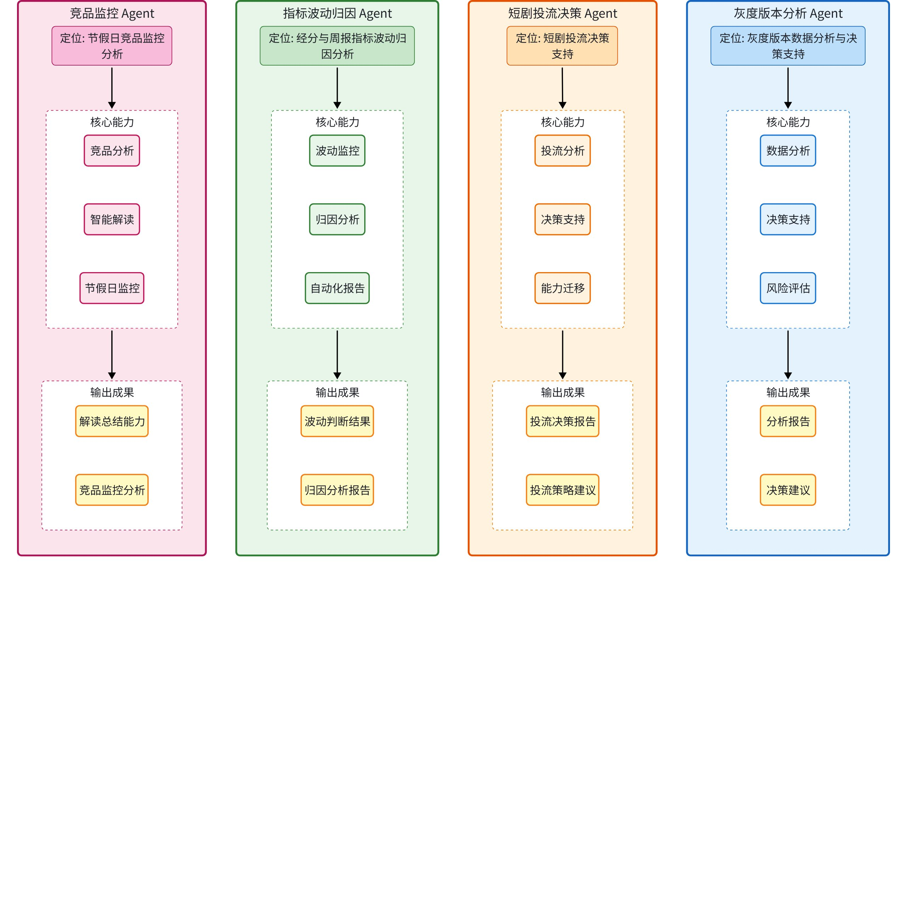

# 从demo 到生产工具 — 数据产品AI实践经验分享

> 本文档为飞书文档归档副本，由 `feishu fetch` 抓取并转换为 Markdown。
> 原文为飞书 docx 资源，下方保留原始内容；图片/白板中的飞书内部图片链接可能因鉴权失效而无法直接渲染，已下载的白板图存放在同目录 `assets/`。

| 字段 | 值 |
|------|----|
| 原文链接 | https://mi.feishu.cn/wiki/GgGGwgEliiR7cRkelGkcEz1Fnaf |
| 资源 token | `RdajdRZSao20LJxzDuhcZjY5npe` |
| 原文最后修改 | 2026-04-08T09:44:45.000Z |
| 抓取归档日期 | 2026-07-02 |

---
<callout emoji="🧑‍💻">
自我介绍：
1、8年互联网产品 数据分析+策略分析的经验
2、从业经历：VIVO、快手、满帮、小米
3、欢迎大家交流 
</callout>

# PART 01 ｜从 Demo 到生产实践的困惑

### 1. 理想与现实的差距

### 2. 实际场景：经典数据分析场景

#### 2.1 一句话需求的“陷阱”

#### 2.2 为满足**一句话需求实际要做的工作**

---

<callout emoji="🔆">
**一句话结论：生产级别的产出的前提是 生产级别的需求**
</callout>

## PART 02 ｜AI 做 Demo ≠ AI 做生产

### 1. 生产场景应用AI需要什么——工程化思路的落地

### 2. Demo 与生产的本质差异

### 3. **一句话总结**

### 4. 行业数据佐证

---

<callout emoji="🔆">
**一句话结论：skill 和 Agent 是将一类场景下的生产级别的需求中共性的部分固化下来**
</callout>

## PART 03 ｜方法论：可拆解 · 可控制 · 可干预

### 1. 核心原则

### 2. 三个阶段的范式转移

### 3. Skill 与 Agent的使用

#### 3.1 Skill 与 Agent的使用场景

#### 3.2 Skill 与 Agent的对比

---

## PART 04 ｜Case 展示

### Case 1：一步到位 vs 分步拆解

#### 1. 问题案例展示

<callout emoji="❌">
**错误示范 - 过于笼统的需求描述**
</callout>

**输入示例:**

> 读取这个表格的数据:
> 
> 1. 我想要对比 content_duration 和 content_duration_new 这两个事件,在不同的 feed_channel 上的 Duration 占比、UV 占比、PV 占比分布
> 2. 仅对 content_duration_new 事件在不同的 feed_channel 上的 Duration、UV、PV、人均 Duration、人均 PV 进行分析,探索哪些频道相关指标符合甚至高于浏览器信息流业务标准,哪些还需优化
> 3. 输出图文结合的飞书文档分析报告给我

**输出不好的结果:** <cite doc-id="Y5jldIA5goj2IlxEnMacJsX6nJh" file-type="docx" title="Feed Channel 数据分析报告 - 2026.03.22" type="doc"></cite>

**问题分析:**

<grid>
<column width-ratio="0.500000">
**需求层面问题**
- 目标过于宽泛,缺乏重点
- 分析维度不清晰
- 缺少业务背景说明
</column>
<column width-ratio="0.500000">
**执行层面问题**
- AI 难以把握分析深度
- 输出结果可能偏离预期
- 需要多次返工调整
</column>
</grid>

#### 2. 正确做法建议

<callout emoji="✅">
**推荐做法:分阶段、有引导地进行沟通**
</callout>

<grid>
<column width-ratio="0.246667">
**第一阶段**
明确身份与目标
提出初步问题
</column>
<column width-ratio="0.246667">
**第二阶段**
引导 AI 深入分析
调整分析框架
</column>
<column width-ratio="0.246667">
**第三阶段**
基于框架执行
输出最终报告
</column>
<column width-ratio="0.250000">
**第四阶段**
进一步润色与美化报告
</column>
</grid>

##### 第一步：阐明身份,提出问题

**初步输出:** <cite doc-id="H7FedTfO8oh9R9xal8aco7n2nHb" file-type="docx" title="🎯 分析建议" type="doc"></cite>

<callout emoji="📝">
**评估结果:** 不满意,没有看出数据中蕴含的问题
</callout>

##### 第二步：继续进行引导式沟通

**优化输出:** <cite doc-id="RJtbd4oN3oLrrKxyfJhcPIi5njh" file-type="docx" title="🎯 最终分析框架建议" type="doc"></cite>

<callout emoji="✅">
**评估结果:** 比较满意这个框架,可以作为后续分析的基础
</callout>

##### 第三步：框架驱动的分析方法

<callout emoji="🎯">
**核心思路:** 将满意的框架和数据表提供给 AI,让它按框架对每部分进行系统化分析
</callout>

**输入指令:**

<blockquote>
以这个 <cite doc-id="RJtbd4oN3oLrrKxyfJhcPIi5njh" file-type="docx" title="🎯 最终分析框架建议" type="doc"></cite> 为框架,给我一个以数据为基础,使用图和表来清晰展示相关部分的数据,再进行分析结果的阐述的分析报告,最后输出飞书文档给我。
</blockquote>

**输出成果:** <cite doc-id="LTCAdSaqLo9GbSxHRclcHdUun2f" file-type="docx" title="浏览器信息流流量地图分析报告" type="doc"></cite>

##### 第四步：文档美化与呈现优化

<callout emoji="🎨">
**最终优化:** 再让AI对生成的文档进行视觉美化和内容润色,提升专业度和可读性
</callout>

**❌ 直接给AI整个文档，让它进行美化**

- 文档内容过多，不明确美化哪个部分
- 指令不够清晰，不明确美化成什么形式
- 会使用python画图，真的很丑

示例：

**✅ 推荐工具：deepseek网页版**

步骤：

1. 直接将需要做图或者做表的部分的文字复制给deepseek
2. 从生成的图表中选择最理想的，让其修改至满意
3. 复制相应的代码给trae或者micode，把图表放到飞书文档中进行输出
4. 对飞书文档中的图表进行编辑、复制、粘贴等操作

示例：

**最终输出:** <cite doc-id="OU9PdcMl8oscx5xQm8ScoMg4nRg" file-type="docx" title="浏览器信息流流量地图分析报告 终" type="doc"></cite>

#### 3. 经验总结

<grid>
<column width-ratio="0.500000">
<callout emoji="❌">
 **避免做法**
- **一次性抛出:** 将所有需求和数据一次性丢给 AI
- **模糊需求:** 缺乏明确的分析目标和方向
- **缺少反馈:** 不对 AI 的输出进行评估和引导
- **期望过高:** 希望 AI 一次性输出完美结果
</callout>
</column>
<column width-ratio="0.500000">
<callout emoji="✅">
 **推荐做法**
- **分阶段沟通:** 逐步明确需求,引导 AI 深入思考
- **框架先行:** 先确定分析框架,再执行具体分析
- **迭代优化:** 通过多轮对话不断完善结果
- **明确目标:** 清晰说明业务背景和分析目的
</callout>
</column>
</grid>

### Case 2：单Skill vs 多Skill+Agent

#### 方案一产出：<cite doc-id="KGr8wc01TicYRJk4zSXcoFHjnrc" file-type="wiki" title="AB测试统计显著性分析报告 - 版本20.11.1010115 vs 20.11.10115" type="doc"></cite>

#### 方案二产出：<cite doc-id="D1m2wYXlNio4LNkHID4cgbVvn5f" file-type="wiki" title="APP版本灰度发布AB分析报告" type="doc"></cite>

### 小TIPS：

<callout emoji="🔆">
使用AI 工具来学习如何使用AI工具
豆包+ trae 
ChatGPT + Claude code 
</callout>

### 打个广告：

<cite doc-id="CRENwLiSyiOZ8xkKXjVc4hZpngY" file-type="wiki" title="AI Native" type="doc"></cite>

欢迎大家共建 

## PART 05 ｜Q&A

---

END
