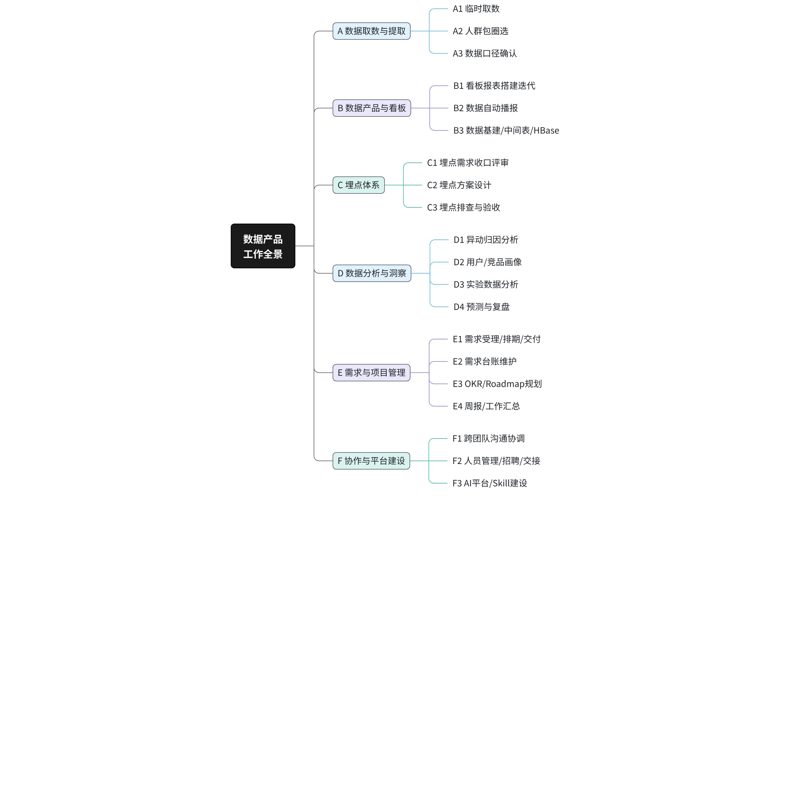
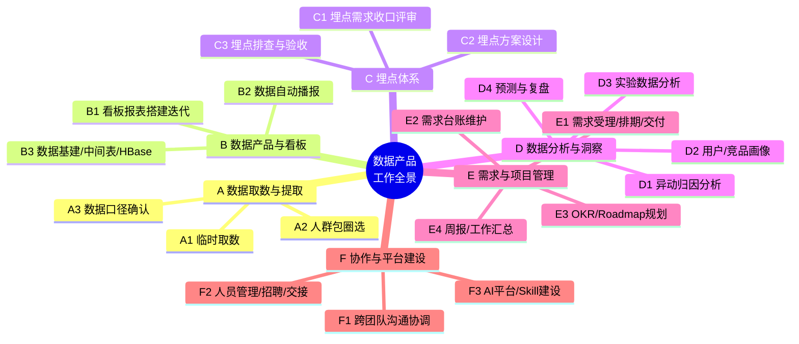

# 龚云荷工作全景与AI可替代性分析（2026 H1）

> 本文档为飞书文档归档副本，由 `feishu fetch` 抓取并转换为 Markdown。白板图存放在同目录 `assets/`。

| 字段 | 值 |
|------|----|
| 原文链接 | https://mi.feishu.cn/wiki/JdzLwjnARi6vfwkrvYrc1SlHnhd |
| 资源 token | `A6m4dSWAxocXqgxPpeXcdKINnIg` |
| 原文最后修改 | 2026-07-01T12:05:03.000Z |
| 抓取归档日期 | 2026-07-02 |

---

<callout emoji="dart" background-color="light-blue" border-color="blue">
**一句话结论**：你是内容生态数据产品经理，但 2026 上半年的时间被大量「取数 + 圈人 + 看板填报」这类高重复事务性工作占据。这些恰恰是 AI 高度可替代的部分——把它们交给 AI，你才能腾出手做真正只有你能做的事（战略、洞察、平台）。这也正是你「打透 nl-sql」战略的根本价值。

**数据来源**：3 份工作台账（上海人文化研究院 90 条 / 内容生态数据需求 62 条 / 埋点评审 45 条）+ 59 份交付文档逐一阅读。统计口径为 2026.01–06。
</callout>

# 一、我是做什么的：真实工作画像

## 角色定位

- **岗位**：数据产品经理（ICE / 内容生态 / 浏览器）
- **双重身份**：既是内容生态业务的数据产品负责人，也是团队数据智能化（nl-sql、ICE Workbench）的推动者
- **资源现状**：团队仅 2 人，杨沈君 6.15 已离职，人力极度紧张——AI 替代不是"选择题"，是"生存题"

## 上半年工作全景

| 台账来源 | 事项总数 | 已完成 | 最大占比工作 |
|------|------|------|------|
| 上海人文化研究院事项 | 90 | 85 | 取数/数据提取（29） |
| 内容生态数据需求 | 62 | 47 | 取数（24）+ 人群包（16） |
| 埋点需求评审 | 45 | 39 | 埋点需求/方案（25） |
| **合计（含重叠）** | **197** | **171** | **取数 + 圈人 + 埋点** |

<callout emoji="fire" background-color="light-orange" border-color="orange">
**核心洞察**：在 197 条事项里，**取数（53+）、人群包圈选（16）、看板填报（8+）合计占比超过一半**（推断约 55–60%）。这些工作的共同特征是——输入高度同构、SQL 骨架高度重复、人工价值主要花在"沟通口径"而非"动脑筋"。你的岗位是"产品经理"，但相当一部分精力其实是在做"人肉取数机 + 圈人机"。
</callout>

# 二、工作分类体系

把 197 条真实事项归纳为 **6 大类、19 个子类**：

# 三、AI 可替代性分析（核心）

## 分级标准

<grid cols="3">
<column>

**🟢 高可替代**

AI 主导执行，人只需验收。可替代 **70%+** 工作量。特征：高重复、高标准化、低判断。

</column>
<column>

**🟡 中可替代**

AI 辅助生成，人做关键判断。可替代 **40–60%**。特征：有模板但需业务拍板。

</column>
<column>

**🔴 低可替代**

人主导，AI 仅提效。可替代 **<30%**。特征：依赖战略判断、跨人协调、经验直觉。

</column>
</grid>

## 可替代性矩阵

| 工作子类 | 频度 | 可替代性 | 判断依据 | AI 承接方式（对应工作区能力） |
|------|------|------|------|------|
| A1 临时取数 | 极高 | 🟢 高 | 指标/维度/周期查询，SQL 单双表聚合，复杂度中低，高度重复 | **nl-sql 自然语言取数**（核心场景） |
| A2 人群包圈选 | 极高 | 🟢 高 | 标签交并集+排除+阈值组合，数据源收敛到固定宽表，模板化极高 | **参数化圈选模板 + nl-sql**，沉淀人群包资产库 |
| B2 数据自动播报 | 高 | 🟢 高 | 日报/财收播报，固定口径固定格式 | 定时脚本 + 播报模板（07-定时任务，已在做） |
| E2 需求台账维护 | 高 | 🟢 高 | 登记/状态流转/查重，纯事务 | 自动提单登记 + bitable 台账同步 |
| E4 周报/工作汇总 | 高 | 🟢 高 | 从记录汇总，结构固定 | daily/weekly_work_review 脚本（已在做） |
| A3 数据口径确认 | 中 | 🟡 中 | 需结合业务判断口径，但可给候选 | 指标口径字典 RAG 给候选，人拍板 |
| B1 看板报表搭建 | 中 | 🟡 中 | SQL 可生成，但指标体系需设计 | 看板 Skill 生成 SQL+配置，人定指标框架 |
| B3 数据基建 | 中 | 🟡 中 | 建表 SQL 可辅助，表设计需判断 | AI 辅助建表，人定分层/口径 |
| C2 埋点方案设计 | 中 | 🟡 中 | 文档骨架/事件表模板化，但归因逻辑、新增vs复用需判断 | **PRD 转埋点 Skill** 生成骨架，人定归因取舍 |
| C3 埋点排查验收 | 中 | 🟡 中 | 可自动比对上报，异常需人判断 | AI 辅助数据比对，人定位问题 |
| D2 用户/竞品画像 | 中 | 🟡 中 | AI 可收集+初稿，洞察需人 | auto-analysis + deepresearch，人提炼洞察 |
| D3 实验数据分析 | 中 | 🟡 中 | 标准化分析可自动，业务显著性需判断 | 实验分析 Agent，人判断业务意义 |
| E1 需求受理/排期 | 中 | 🟡 中 | 提单可自动，优先级需权衡 | 自动流转+提醒，人定优先级 |
| F3 AI平台/Skill建设 | 中 | 🟡 中 | 编码可辅助，方向需人定 | Claude Code/Codex 辅助编码，人定产品方向 |
| C1 埋点需求收口评审 | 中 | 🔴 低 | 多方拉齐、现场对齐、责任划分 | AI 仅做会议纪要/提醒 |
| D1 异动归因分析 | 中 | 🔴 低 | 需业务上下文+多信息交叉+假设验证 | AI 跑数+列假设，人定结论 |
| D4 预测与复盘 | 低 | 🔴 低 | 需战略视角与经验 | AI 辅助整理数据，人主导判断 |
| E3 OKR/Roadmap规划 | 低 | 🔴 低 | 战略取舍、资源分配 | AI 辅助整理，人定方向 |
| F1 跨团队沟通协调 | 高 | 🔴 低 | 谈判、对齐、关系维护 | 人主导，AI 辅助信息准备 |
| F2 人员管理/交接 | 低 | 🔴 低 | 招聘、带教、组织决策 | 人主导 |

## 分级汇总

<grid cols="3">
<column>

**🟢 高可替代（5 类）**

- A1 临时取数
- A2 人群包圈选
- B2 数据自动播报
- E2 需求台账维护
- E4 周报/工作汇总

> 这 5 类占你实际工作量最大头，是 AI 化的**第一优先级**。

</column>
<column>

**🟡 中可替代（9 类）**

- A3 口径确认
- B1 看板搭建
- B3 数据基建
- C2 埋点方案设计
- C3 埋点排查
- D2 画像分析
- D3 实验分析
- E1 需求排期
- F3 平台建设

> AI 做 60%，你做关键 40%。

</column>
<column>

**🔴 低可替代（6 类）**

- C1 埋点评审组织
- D1 异动归因
- D4 预测复盘
- E3 OKR规划
- F1 跨团队协调
- F2 人员管理

> 这才是你的**核心价值区**，应该投入更多时间。

</column>
</grid>

<callout emoji="bulb" background-color="light-green" border-color="green">
**关键结论**：你上半年最耗时的工作（取数+圈人+看板填报）几乎全部落在🟢高可替代区。这从数据上验证了「打透 nl-sql」战略方向的正确性——它瞄准的正是你和团队最大的时间黑洞。**AI 替代的目标不是取代你，而是把你从"人肉取数机"升级回"数据产品经理"**，把时间还给🔴低可替代的高价值工作。
</callout>

# 四、落地建议：让工作区真正帮到你

## 优先级排序

| 优先级 | 动作 | 解决的痛点 | 承接能力 |
|------|------|------|------|
| P0 | 把 A1/A2 取数圈人沉淀为 **SQL 模板库 + 人群包资产库** | SQL 散落文档附录、交付靠私聊截图、无资产登记 | nl-sql + 知识库 data-analysis |
| P0 | nl-sql 覆盖三大高频簇（小说SDK/top-N/实验对比留存） | 取数 SQL 骨架高度重复 | nl-sql Skill |
| P1 | 建 **指标口径字典**，沉淀反复确认的口径 | A3 口径反复沟通 | 知识库 + RAG |
| P1 | 需求提单→排期→台账→交付**全流程自动流转** | E1/E2 事务性登记 | bitable + 定时任务 |
| P2 | PRD 转埋点 Skill 落地 | C2 埋点方案骨架重复 | Skill 开发 |

## 这个工作区的升级方向

<callout emoji="rocket" background-color="light-blue" border-color="blue">
当前工作区强在「**知识管理 + 记录**」（知识库、每日回顾、决策闭环都已成型），但你最痛的「**取数/圈人/看板执行**」还没有在工作区里形成闭环。下一步应把工作区从"知识库+记事本"升级为"**能直接干活的执行台**"：

1. **数据资产层**：在 `00-知识库/data-analysis/` 下建 SQL 模板库、指标口径字典、人群包登记表，把 59 份交付文档里的可复用逻辑沉淀下来，直接喂给 nl-sql。
2. **需求流接入**：把三份飞书台账反映的真实需求流接进工作区，形成 `需求 → 取数/圈人 → 交付 → 沉淀` 的闭环。
3. **执行与知识打通**：让 ICE Workbench / nl-sql 直接调用工作区沉淀的模板和口径，实现"越用越准"。
</callout>

---

> 关联台账：[上海人文化研究院事项汇总](https://mi.feishu.cn/docx/F2oudjKw3ovluDxfL29cFVCMnxf) ｜ [内容生态数据需求汇总](https://mi.feishu.cn/docx/Cn3Fd0j4Ko5h6sxV4SHc7tcbnjc) ｜ [内容生态埋点评审事项](https://mi.feishu.cn/docx/PvwWdIvCOo78dixjX3sccFfJnWh)
>
> 生成日期：2026-07-01 ｜ 分析基于 3 份台账 197 条事项 + 59 份交付文档
