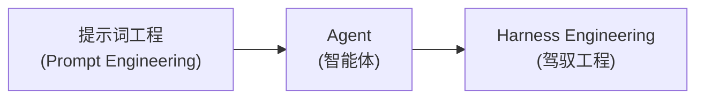
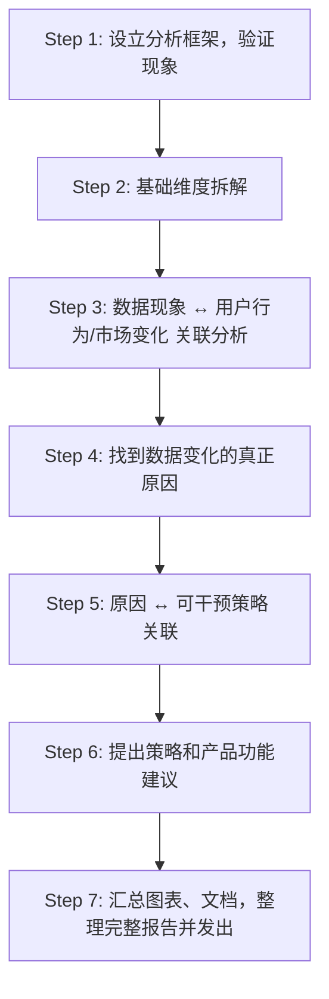
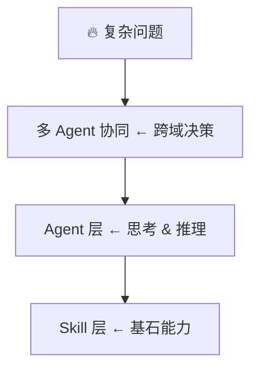
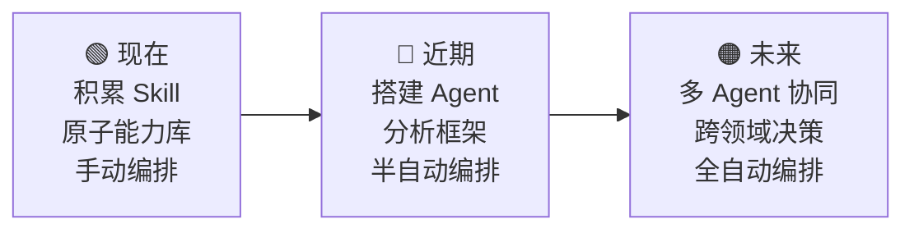

# 用 AI 进行生产级工作 — 分享材料框架 {color="blue" align="center"}

---

## 一、开场：AI 做 Demo ≠ AI 做生产

### 核心论点

<callout emoji="dart" background-color="light-blue">

从 **需求** → **生产过程** → **产出**，这条链路上的每一个节点，必须做到：
- 具体的、详细的、定义清晰的
- 可检验、可修改、可校正

</callout>

### 关键结论

<grid cols="3">
<column>

<callout emoji="x" background-color="light-red">

**拒绝一句话需求**

</callout>

</column>
<column>

<callout emoji="x" background-color="light-red">

**没有能解决一切问题的银弹**

</callout>

</column>
<column>

<callout emoji="x" background-color="light-red">

**不存在全知全能的上帝**

</callout>

</column>
</grid>

### 行业数据佐证

<callout emoji="bar_chart" background-color="light-yellow">

- 超过 **90%** 的 AI Agent 项目停留在"好看的 Demo"阶段，无法落地生产环境
- **64%** 的中国企业已在测试或计划部署 AI 智能体，但真正规模化应用仍是少数
- Agent 市场以 **44.8%** 的年复合增长率增长（2024年51亿→2030年471亿美元）
- 核心瓶颈：**缺乏系统性的工程化落地框架**

<text color="gray">数据来源：中国信通院《智能体技术和应用研究报告2025》、麦肯锡</text>

</callout>

### 行业共识：Demo 与生产的本质差异

| 维度 | Demo 级别 | 生产级别 |
|------|----------|---------|
| 场景 | 理想场景下跑通流程 | 应对真实业务的复杂场景 |
| 容错 | 容忍偶尔出错 | 必须可靠、可控、可观测 |
| 异常 | 手动干预即可 | 必须自主处理异常与故障 |
| 生命周期 | 一次性使用 | 持续迭代、安全合规 |
| 核心关注 | 关注"能不能做" | 关注"做得稳不稳" |
| **工程占比** | **5% 工程 + 95% Prompt** | **95% 工程 + 5% Prompt/LLM** |

<callout emoji="fire" background-color="light-orange">

**一句话总结：** 生产级 AI Agent 的落地，**95% 是工程能力**，只有 5% 来自 LLM 与 Prompt 本身。

</callout>

---

## 二、方法论：可拆解 · 可控制 · 可干预

### 核心原则

<callout emoji="bulb" background-color="light-blue">

每一个环节，必须保证：**可控的** · **符合预期的** · **稳定产出的**

</callout>

### 演进脉络

> 框架在演进，但思路是明确的。

### 行业演进脉络补充：三个阶段的范式转移

#### 阶段一：提示词工程（2023-2024）

<callout emoji="memo" background-color="pale-gray">

- **核心方式**：手搓 Prompt，写好系统提示词
- **典型问题**：
  - 上下文污染：Prompt 长达数万 Token，模型注意力分散
  - 复用性差：逻辑硬编码在对话中，无法跨项目迁移
  - 不稳定：同样的任务，今天好明天差，换个模型就更飘
- **行业评价**：这是"草莽时代"

</callout>

#### 阶段二：Agent + Skill 分层（2024-2025）

<callout emoji="rocket" background-color="light-green">

- Anthropic 2024年11月推出 **MCP（Model Context Protocol）**
  → 统一了"AI 连接工具/数据源"的标准
  → 被称为"**AI 世界的 USB-C 接口**"
- Anthropic 2025年10月推出 **Agent Skills**，12月成为开放标准
  → 将复杂 Prompt 封装为标准化的文件结构（SKILL.md）
  → 引入"渐进式披露"，**Token 消耗降低 60%-80%**
- **行业评价**：从"手搓 Prompt"到"标准化封装"的工业时代

</callout>

#### 阶段三：Harness Engineering / 上下文工程（2025-至今）

<callout emoji="zap" background-color="light-blue">

- **核心理念**：借鉴"关注点分离"的软件工程原则
- 将一体化 Agent 解构为 **规划 → 推理 → 执行** 三个独立层
- 阿里云实践：引入 API 知识图谱，API选择准确率接近 100%
- **行业金句（阿里云2025云栖大会）**：

> "模型的迭代，决定了 AI Agent 能跳多高；知识与架构工作，决定了它能走多远。"

</callout>

### 提出方案 & 抛出问题

<callout emoji="dart" background-color="light-blue">

**方案**：用工程化的方式去思考一个具体的复杂问题，拆解到用 **Agent + Skill** 去组合解决。

</callout>

<grid cols="3">
<column>

<callout emoji="wrench" background-color="light-green">

**什么问题适合 Skill？**

确定性强、可标准化

</callout>

</column>
<column>

<callout emoji="brain" background-color="light-blue">

**什么问题适合 Agent？**

需推理、决策

</callout>

</column>
<column>

<callout emoji="handshake" background-color="light-purple">

**什么问题适合多 Agent？**

跨领域、多视角

</callout>

</column>
</grid>

### Skill 与 Agent 的本质区别（行业共识）

<grid cols="2">
<column>

<callout emoji="bust_in_silhouette" background-color="light-blue">

**Agent = 企业里的员工（项目经理）**
- 有自主决策能力，能理解目标
- 感知环境、规划路径、应对意外
- 核心能力是：**自主性、决策力**

</callout>

</column>
<column>

<callout emoji="wrench" background-color="light-orange">

**Skill = 员工使用的 APP / 工具 / SOP 手册**
- 被动调用，不会自己启动
- 确定性强，标准化，可复用
- 核心能力是：**准确性、稳定性**

</callout>

</column>
</grid>

| 维度 | Agent（智能体） | Skill（技能） |
|------|----------------|--------------|
| 类比角色 | 企业中的员工 | 员工用的工具/SOP |
| 工作方式 | 主动思考、决策 | 被动调用、按规执行 |
| 生命周期 | 持续运行，有状态 | 按需加载，用完释放 |
| 核心价值 | 决策与编排能力 | 标准化与可复用 |
| 执行模式 | 循环推理+决策+执行 | 线性执行，无状态 |
| 适用场景 | 开放性、需推理的 | 规则明确、流程固定 |
| 上下文消耗 | 大（全局状态） | 小（按需加载） |

<callout emoji="bulb" background-color="light-yellow">

**一句话**：Agent 是"谁来做"，Skill 是"怎么做"。

</callout>

### 什么时候用什么？（判断标准）

<grid cols="3">
<column>

##### 适合 Skill 的特征

- ✅ 输入输出明确
- ✅ 流程固定、规则清晰
- ✅ 可标准化、可复用
- ✅ 不需要"想"，只需要"做"

<text color="gray">例：取数、写SQL、画图、写文档</text>

</column>
<column>

##### 适合 Agent 的特征

- ✅ 需要理解意图和上下文
- ✅ 需要规划和拆解任务
- ✅ 需要根据中间结果动态调整
- ✅ 存在不确定性，需要判断

<text color="gray">例：数据归因分析、策略推理</text>

</column>
<column>

##### 适合多 Agent 协同的特征

- ✅ 跨领域、跨专业
- ✅ 需要多视角碰撞和验证
- ✅ 单个 Agent 知识面不足
- ✅ 需要角色分工协作

<text color="gray">例：归因 + 策略 + 竞品对比</text>

</column>
</grid>

---

## 三、实战案例：经典数据分析场景

### 3.1 一句话需求的陷阱

<callout emoji="warning" background-color="light-yellow">

**老板说：** "最近的 DAU 有一些异常波动，参考上次的分析做更深入一点的分析。"

</callout>

**隐藏的信息量：**

<grid cols="3">
<column>

##### DAU 是什么？

- 浏览器整体 DAU
- 浏览器主动启动 DAU
- 浏览器 Push DAU
- 浏览器三方调起 DAU
- 浏览器信息流 DAU
- 浏览器搜索 DAU

</column>
<column>

##### 波动是什么？

- 哪几类 DAU 在波动？全部还是部分？
- 波动方向？上涨还是下跌？
- 不同指标是同向波动还是反方向波动？

</column>
<column>

##### 上次分析是什么？

- 上次分析的结论停止在哪一步？
- 继续深入是怎样的？
- 在哪些方向进行深入？

</column>
</grid>

<callout emoji="dart" background-color="light-green">

→ 与老板交互确认以上信息后，才能开工。

</callout>

**行业类似案例（阿里云2025云栖大会分享）：**

<callout emoji="warning" background-color="light-red">

早期方案中，一次普通的云环境创建交互，Token 消耗高达 **6 万**（相当于让大模型写完半部《西游记》），端到端成功率却不足 **10%**。

**核心原因**：一股脑把模糊需求丢给 AI，没有拆解、没有确认、没有分层。

</callout>

### 3.2 数据分析的标准工作流

### 3.3 哪些环节用 AI？怎么用？

<grid cols="3">
<column>

<callout emoji="wrench" background-color="light-green">

**Skill 层**
确定性强、可标准化、可复用的原子能力

- 取数（执行 SQL 查询，返回结果）
- NL-to-SQL（理解数据需求，生成对应 SQL）
- 画图画表（数据可视化）
- 写飞书文档（报告输出）

</callout>

</column>
<column>

<callout emoji="brain" background-color="light-blue">

**Agent 层**
需要思考、推理、决策的环节

- 从数据现象中做基础维度拆解
- 拆解数据 → 关联用户行为
- 找到原因后 → 关联可干预策略和功能

</callout>

</column>
<column>

<callout emoji="handshake" background-color="light-purple">

**多 Agent 协同层**
跨领域、多视角协作的复杂决策

- 原因归因 + 策略制定（可能需要多 Agent 协同）

</callout>

</column>
</grid>

**映射到工作流的每一步：**

| 工作流 | 具体动作 | 用什么 |
|--------|---------|--------|
| Step 1 | 明确分析框架 | Agent 规划 |
| Step 2 | 写 SQL 取数 | Skill |
| Step 2 | 执行查询返回结果 | Skill |
| Step 2 | 决定拆解哪些维度 | Agent 推理 |
| Step 3 | 关联用户行为 / 市场变化 | Agent 推理 |
| Step 4 | 找到根因 | Agent 推理 |
| Step 5 | 根因→策略→干预方向 | 多Agent协同 |
| Step 6 | 产品功能建议 | 多Agent协同 |
| Step 7 | 画图画表 | Skill |
| Step 7 | 写飞书文档 | Skill |
| Step 7 | 整合报告并发出 | Agent 编排 |

### 3.4 金字塔框架

<callout emoji="bulb" background-color="light-blue">

**核心思路：**
1. **识别**：哪些环节用 Agent，哪些环节用 Skill
2. **搭建**：构建 Agent + Skill 的协作框架
3. **执行**：Agent 调用 Skill，逐步完成问题

</callout>

### 3.5 行业对标：生产级 Agent 的 7 个能力环节

<callout emoji="rocket" background-color="light-green">

一个生产级 AI Agent 必须完整实现以下 **7 个环节**（缺一不可）：

</callout>

1. ① 接收目标与指令，理解真实意图
2. ② 基于目标完成推理、拆解与任务规划
3. ③ 自主选择并调用合适的工具（Skill）完成子任务
4. ④ 持续记忆上下文信息、历史交互与业务知识
5. ⑤ 基于规划与工具结果执行确定性动作
6. ⑥ 自主处理执行中的异常与失败，完成故障自愈
7. ⑦ 基于执行结果完成效果评估，实现持续迭代优化

<callout emoji="fire" background-color="light-orange">

其中只有 **①②** 依赖 LLM 与 Prompt，剩下的 **③④⑤⑥⑦** 全部需要完整的工程体系支撑。

**这也解释了：为什么做 Demo 容易，做生产难。Demo 只做了①②，生产要做全部七个。**

</callout>

---

## 四、行业前沿：技术栈演进与标准化趋势

### 4.1 MCP：AI 世界的 USB-C 接口

<callout emoji="electric_plug" background-color="light-blue">

**MCP（Model Context Protocol）** 是 Anthropic 推出的开放标准协议。

</callout>

**解决的核心问题：**

<grid cols="2">
<column>

<callout emoji="x" background-color="light-red">

**之前：N x M 专用胶水**

- CRM ← 自定义 → AI应用A
- ERP ← 自定义 → AI应用A
- CRM ← 自定义 → AI应用B
- ERP ← 自定义 → AI应用B
- = **4 套集成代码**

</callout>

</column>
<column>

<callout emoji="white_check_mark" background-color="light-green">

**之后：统一 MCP 协议**

- CRM ← MCP Server →
- ERP ← MCP Server →
- ← MCP Client → AI应用
- = **复杂度从 O(M×N) 降到 O(M+N)**

</callout>

</column>
</grid>

**2025年关键进展：**
- MCP 协议捐赠给 Linux 基金会 Agentic AI 基金会（AAIF）
- 与 OpenAI 的 AGENTS.md 共同构成智能体开发的支柱
- 已成为行业标准，支持工具调用、数据源接入、权限管理

### 4.2 Agent Skill：渐进式披露架构

<callout emoji="zap" background-color="light-green">

**核心突破**：不是把所有知识塞进 Prompt，而是**按需加载**。

</callout>

| 层级 | 加载内容 | Token 消耗 |
|------|---------|-----------|
| 第一层 | 仅技能名称和描述 | 约 20-50 |
| 第二层 | 完整 SKILL.md 指令 | < 5,000 |
| 第三层 | 关联的脚本、文档等资源 | 按需加载 |

<callout emoji="bulb" background-color="light-yellow">

**意味着：**
- 可以给一个 Agent 装备**上千个** Skill，平时只占极少上下文
- 只有任务真正需要某个 Skill 时，完整指令才被加载
- 实测 Token 消耗降低 **60%-80%**

</callout>

### 4.3 Flow Engineering：确定性流程工程

<callout emoji="shield" background-color="light-blue">

对于高可靠性要求的企业级应用，不能完全依赖 LLM 的概率性输出。

</callout>

**核心思想：**
- 将业务逻辑构建为 **有向无环图（DAG）** 或 **有限状态机（FSM）**
- LLM 退化为"**语义路由**"或"**信息提取器**"
- 核心业务规则被代码锁死，LLM 无法产生幻觉去跳过规则

**在我们的数据分析场景中的体现：**

| 环节 | 方式 | 说明 |
|------|------|------|
| 取数流程 | Skill（确定性） | NL-to-SQL 是 Skill，SQL 执行也是 Skill |
| 分析推理 | Agent（固定框架） | 走固定的框架流程（先验证→拆解→归因） |
| 报告输出 | Skill（确定性） | 格式固定、流程确定 |

> 这就是"可控"和"可干预"的工程化体现。

---

## 五、Case 展示

### Case 1：Skill & Agent 能力库

<callout emoji="gift" background-color="light-green">

我们正在逐步完善的 Skill 和 Agent 库，**欢迎大家加入共建**！

</callout>

| Skill 名称 | 能力描述 |
|------------|---------|
| nl-sql | 自然语言转 SQL 查询 |
| sql | 连接数据仓库执行查询并返回结果 |
| auto-analysis | 核心指标自助分析 Agent |
| feishu | 飞书全量资源管控 |
| feishu-doc | 飞书文档优化与美化 |
| pptx | PPT 创建与编辑 |
| confidence | AB 测试置信度检测 |
| feed-release-ab | 版本灰度数据分析 |

### Case 2：一股脑 vs 拆解四步

<grid cols="2">
<column>

<callout emoji="x" background-color="light-red">

**方式 A：一股脑抛给 AI**

- 一句话需求直接丢给 AI
- 期望 AI 一次性给出答案
- 无法检验中间过程
- 结果不可控、不可复现
- **结果：?**

</callout>

</column>
<column>

<callout emoji="white_check_mark" background-color="light-green">

**方式 B：拆成四个步骤**

- Step 1: 明确问题 & 拆解
- Step 2: 逐步取数 & 分析
- Step 3: 关联归因 & 推理
- Step 4: 策略建议 & 报告
- **结果：?**

</callout>

</column>
</grid>

→ **现场演示两种方式的差异和效果对比**

**预期对比维度：**

| 维度 | 一股脑 | 拆解四步 |
|------|--------|---------|
| 准确性 | <text color="red">低</text> | <text color="green">高</text> |
| 可解释性 | <text color="red">黑盒</text> | <text color="green">每步可查</text> |
| 可修正性 | <text color="red">只能重来</text> | <text color="green">可以回溯修正</text> |
| 可复用性 | <text color="red">无</text> | <text color="green">Skill可复用</text> |
| 稳定性 | <text color="red">波动大</text> | <text color="green">稳定可预期</text> |

---

## 六、总结与展望

### 6.1 核心观点回顾

<grid cols="2">
<column>

<callout emoji="one" background-color="light-blue">

**AI 做生产 ≠ AI 做 Demo**
→ 95% 是工程，5% 是模型

</callout>

<callout emoji="three" background-color="light-blue">

**金字塔框架：Skill → Agent → 多 Agent 协同**
→ 识别 → 搭建 → 执行

</callout>

</column>
<column>

<callout emoji="two" background-color="light-orange">

**拒绝一句话需求**
→ 每个节点必须具体、可检验、可修正

</callout>

<callout emoji="four" background-color="light-orange">

**行业正在从"手搓 Prompt"走向"工程化标准"**
→ MCP、Agent Skills、Flow Engineering

</callout>

</column>
</grid>

### 6.2 我们的实践路径

### 6.3 一句话结尾

<callout emoji="star" background-color="light-blue">

用 AI 做生产，不是让 AI 替代你思考，
**而是让你用工程化的方式，驾驭 AI 去稳定地交付结果。**

</callout>

---

<text color="gray" align="center">END</text>
